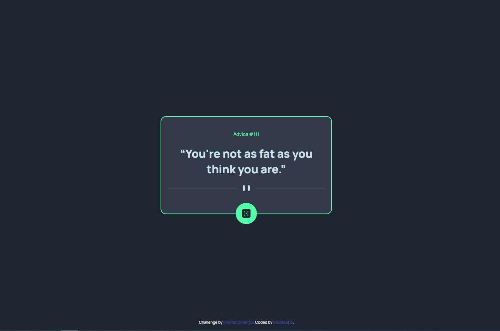
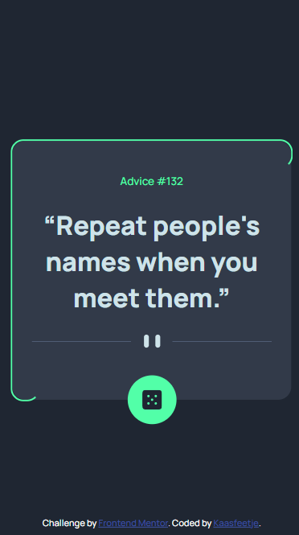

# Frontend Mentor - Advice generator app solution

This is a solution to the [Advice generator app challenge on Frontend Mentor](https://www.frontendmentor.io/challenges/advice-generator-app-QdUG-13db). Frontend Mentor challenges help you improve your coding skills by building realistic projects.

## Table of contents

-   [Overview](#overview)
    -   [Screenshot](#screenshot)
    -   [Links](#links)
-   [My process](#my-process)
    -   [Built with](#built-with)
    -   [What I learned](#what-i-learned)
    -   [Useful resources](#useful-resources)
-   [Author](#author)

## Overview

### Screenshot

### Links

-   Solution URL: [Github](https://github.com/Kaasfeetje/Frontend-Mentor-Advice-generator)
-   Live Site URL: [Site](https://advicegenerator-kaasfeetje.netlify.app/)

## My process

I setup the basic HTML template, but for styling I needed some actual text so I figured why not just start witb the API call. It was a pretty simple call, just had to remind myself how fetch api worked(since I normally use axios). When we get the response back I just set the advice-id and advice-text elements with the appropiate data.

Then I styled the project like the design, but I realized a limitation in the API. It caches the advice for 2 seconds, meaning you can't get a new one every time you click the button. That gave me the idea of having some kind of indicator of the 2 seconds. So I made an animation of the border after you make a request, to indicate the cooldown. I had some help of a youtube video, but I modified it slightly to my needs.

### Built with

-   HTML
-   CSS
-   Plain javascript

### What I learned

I learned more about CSS animations and keyframes.

I also learned how to animate a border, using before and after psuedoelements.

### Useful resources

-   [Border animation](https://youtu.be/JAdIgiGA0Lk) - This helped me make the border animation, I modified it to work on border-radius.

## Author

-   Github - [Kaasfeetje](https://github.com/Kaasfeetje)
-   Frontend Mentor - [@Kaasfeetje](https://www.frontendmentor.io/profile/Kaasfeetje)
-   Twitter - [@veldhuisMax](https://twitter.com/VeldhuisMax)
